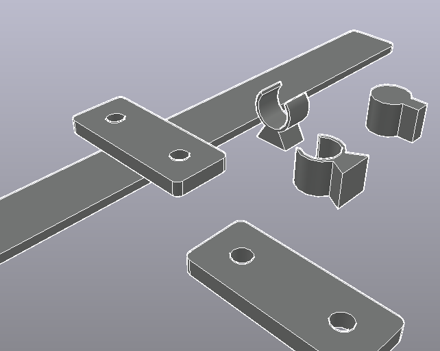

# Front LED Light-Bar Holder — Electric Rover

A bracket that carries a Ø50 × 900 mm LED light bar across the front of an
electric rover: a 2 m rail bolted to two chassis pick-up points, with two
split clamps holding the light bar 45 mm above it.

Completed from an unfinished AutoCAD model (`front LED.dwg`, AutoCAD 2018
format). The original contained seven loose solids and three construction
lines, none of them assembled, dimensioned, or positioned relative to one
another.

---

## Key features

- **A fully parametric assembly.** Every dimension lives in one parameter block;
  change a number and the whole model — solids, holes, fastener positions,
  drawing sheet — regenerates.
- **A stiffness-driven rail section**, chosen by running the beam case rather
  than by picking a plausible-looking bar.
- **Crush tubes at every bolt**, so the closed rail section survives being
  torqued up.
- **A 2 mm EPDM liner between clamp and light bar**, with the bore opened to
  suit, isolating aluminium from the light-bar housing.
- **An A3 manufacturing drawing generated from the same source as the 3D
  model**, so the sheet and the solids cannot disagree.
- **Two exchangeable rail sections** — the RHS as built, and the original flat
  bar — selectable from one parameter for anyone who wants to see the
  comparison.

## What was in the original file

Decoded from the DWG with LibreDWG and the embedded preview bitmap:

| | |
|---|---|
| Units | millimetres (`INSUNITS = 4`) |
| Model extents | X 1501.11 → 3501.11 (**2000.00**), Y 751.53 → 1961.16, Z −128.66 → 168.66 |
| Entities | 7 × `3DSOLID`, 3 × `LINE`, all on layer `0` |
| Solid history | 5 × `ACSH_EXTRUSION_CLASS` — the solids were made with EXTRUDE |
| Layouts | `Layout1`, `Layout2` — both empty |

The seven solids account exactly for **1 rail + 2 mounting plates + 4 clamp
halves**. The three lines are construction geometry, and they turned out to be
the most useful thing in the file:

| Line | Length | Reading |
|---|---|---|
| X 1551.115 → 1751.115 @ Y 1704.656 | 200 mm | left mounting-plate footprint, inset 50 mm from the rail end |
| X 3251.115 → 3451.115 @ Y 1704.656 | 200 mm | right mounting-plate footprint, mirrored about X = 2501.115 |
| X 2621.997 → 2741.997 @ Y 798.169 | 120 mm | bolt-hole pitch on the mounting plate |

Both 200 mm lines sit at the same Y, are symmetric about the rail centre, and
are inset 50 mm from the extreme X values. That fixes the rail at **2000 mm
long**, the plates at **200 mm** with a **120 mm hole pitch**, and the mount
span at **1700 mm** — and those four numbers drive the whole completed design.

### What was missing

- Parts were scattered in space, not assembled (clamps parked ~900 mm away in Y)
- No bolt holes anywhere — the plates' holes were the only circular features
- No layers, no materials, no drawing sheet, no BOM
- No clearance between the clamp bore and the light bar
- No structural check of the rail

---

## The completed design

Origin is the centre of the rail, on its top face. **+X** along the rail,
**+Y** forward (the way the light points), **+Z** up.

| Item | Description | Qty | Material |
|---|---|---|---|
| 1 | Rail, RHS 90 × 30 × 3, 2000 long | 1 | 6061-T6 |
| 2 | Chassis mounting plate 200 × 90 × 10, 2 × Ø11 @ 120 | 2 | 6061-T6 |
| 3 | Clamp saddle 80 × 90 × 45, Ø54 bore | 2 | 6061-T6 |
| 4 | Clamp strap 80 × 90 × 22, Ø54 bore | 2 | 6061-T6 |
| 5 | Crush tube 20 OD × 11 ID × 24 | 4 | 304 stainless |
| 6 | Crush tube 14 OD × 6.6 ID × 24 | 4 | 304 stainless |
| 7 | Bolt M10 × 60, nut + washers | 4 | A2-70 |
| 8 | Bolt M6 × 100, nyloc + washers | 4 | A2-70 |
| 9 | EPDM liner 2 thk × 170 × 80 | 2 | EPDM 60 Sh |
| 10 | LED light bar Ø50 × 900 *(reference)* | 1 | purchased |

Envelope **2000 × 90 × 110 mm**, fabricated mass **6.54 kg** (6.28 kg aluminium
+ 0.26 kg stainless), light bar and fasteners excluded.

## Three decisions worth explaining

### 1. The rail section was changed from flat bar to RHS

This is the one place the completed model departs from what was drawn, and it
is the reason the project needed finishing rather than just assembling. Running
the beam case — simply supported at the two chassis plates 1700 mm apart, two
clamp loads 550 mm inboard of each support, plus self weight:

| Section | I (mm⁴) | Mass | Deflection | L/δ | σ | f₁ |
|---|---|---|---|---|---|---|
| Flat 90 × 8 *(as drawn)* | 3 840 | 3.89 kg | **15.74 mm** | L/108 | 14.2 MPa | **5.0 Hz** |
| Flat 90 × 10 | 7 500 | 4.86 kg | 9.06 mm | L/188 | 10.2 MPa | 6.4 Hz |
| **RHS 90 × 30 × 3** | **105 732** | **3.69 kg** | **0.56 mm** | L/3050 | 1.9 MPa | **26.4 Hz** |
| RHS 90 × 40 × 3 | 204 872 | 4.02 kg | 0.30 mm | L/5669 | 1.4 MPa | 35.8 Hz |

Stress is never the constraint — everything is far below the 240 MPa yield of
6061-T6. The rail is **stiffness driven**, and stiffness is the criterion a
first pass usually gets wrong, because a section that is nowhere near breaking
still reads as "strong enough".

The flat bar as drawn sags about 16 mm at the clamps, which visibly mis-aims a
light bar, and its first bending mode lands at ~5 Hz — squarely inside the band
a rover chassis excites over rough ground. The 90 × 30 × 3 RHS is 28× stiffer,
moves the first mode to 26 Hz, and is *lighter* than the flat bar it replaces.
Closing a hollow section buys second moment of area roughly as the square of
depth while paying for it only in perimeter, which is why the trade comes out
this lopsided.

The original flat bar is still selectable: set `*RAIL-SECTION*` to `"FLAT"` in
the LISP (and `RAIL_SECTION` in `params.py`) and everything regenerates.

### 2. Crush tubes at every bolt

A closed RHS collapses when you torque a bolt through both walls. Eight
stainless sleeves sit in the cavity so the preload goes through the sleeve, not
the tube wall. Without them, item 1 gets dented flat at all eight bolt positions
on first assembly — and a dented rail has lost exactly the second moment of area
decision 1 was made to buy.

Stainless rather than aluminium: the sleeve carries the full clamp load in
compression for the life of the bracket, and 304 does not creep the way a soft
aluminium sleeve would under sustained preload.

### 3. Ø54 bore for a Ø50 bar

The original clamp bore matched the bar exactly, which leaves no room for the
2 mm EPDM liner. The liner does two jobs: it grips the bar without point-loading
it, and it keeps aluminium off the light-bar housing so the rail's 26 Hz mode
does not fret through the anodising. A metal-on-metal clamp at that frequency
polishes a flat into the bar and then loosens.

---

## The manufacturing drawing

An A3 sheet drawn 1:1 in millimetres — front elevation and plan at 1:10,
section A-A through a clamp and the chassis plate detail at 1:2, with a title
block, BOM and notes. Dimensions carry a `DIMLFAC` override, so every one reads
the true size of the part despite the view scale.

It exists twice, from the same source:

- **on the `A3 DRAWING` layout of the 3D DWG** — paper space, A3 page already
  set up, so the finished file carries the sheet and the model together.
- **`cad/front-led-mount-drawing.dxf`** — the same sheet in model space as a
  standalone file, for importing into someone else's drawing or handing to a
  shop that does not want the 3D model.

## Why the model is built by script

The assembly is described by an AutoLISP program rather than placed by hand, and
the parameters live in one block at the top of it. That choice is what makes
decision 1 possible: swapping the rail from flat bar to RHS is one symbol, and
the plates, the crush tubes, the bolt lengths and the drawing sheet all follow.
Hand-modelled, that comparison would have been a day's rework and would
therefore not have been made.

The same parameters are mirrored in `params.py`, which drives the drawing
generator — so the sheet's dimensions come from the same numbers as the solids
rather than from someone reading them off the model.

---

## Next steps and possible improvements

- **Fit the rover's real numbers.** `RAIL_LEN` and `PLATE_CTR_X` are taken from
  the original drawing's extents, not from the vehicle. They are the two
  parameters most likely to be wrong.
- **Confirm the light bar's actual mass**; 2.5 kg is assumed. Deflection and
  first-mode frequency scale roughly with √mass, so a 4 kg bar moves the 26 Hz
  result to about 21 Hz.
- **Run a proper modal analysis if the rover sees sustained excitation above
  ~15 Hz.** The 26 Hz figure is a hand calculation on a uniform beam with
  distributed mass; the real structure has two discrete clamp masses and a bar
  that contributes its own stiffness.
- **Add a slotted adjustment in the saddle** if the light bar needs aiming after
  mounting. The aim is presently fixed by the bore axis, which means getting it
  wrong is a re-machining job rather than a spanner job.
- **Reconsider the mount span.** 1700 mm between supports is inherited from the
  original construction lines. Moving the plates outboard is the cheapest
  remaining stiffness gain available — deflection goes as span⁴ between
  supports — and costs nothing but chassis pick-up points.
- **Check the bolted joint properly.** The crush tubes make the joint sane, but
  no preload, slip or bearing calculation has been done; the M10s are sized by
  convention rather than by analysis.
- **Add a drainage path.** A 2 m closed section pointing into the weather on a
  rover will collect water at one end. A small hole at the low point costs
  nothing and is easier to add now than after anodising.
- **Corrosion at the aluminium/stainless interface.** The crush tubes sit
  directly in the aluminium rail. For anything other than dry-weather use, an
  insulating washer or a coated sleeve is worth the extra part number.
