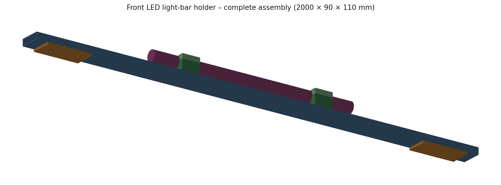
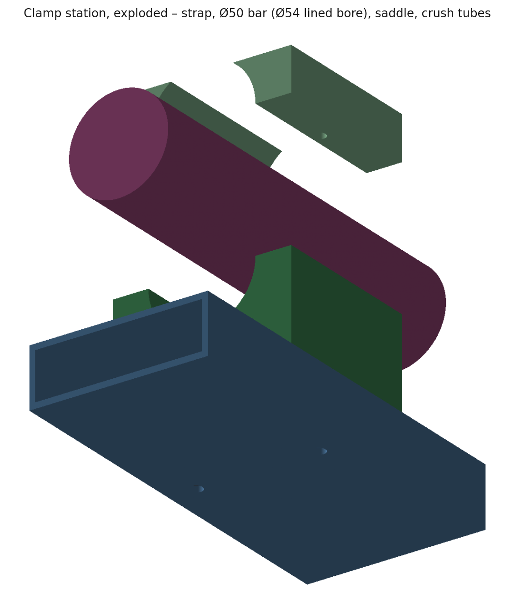
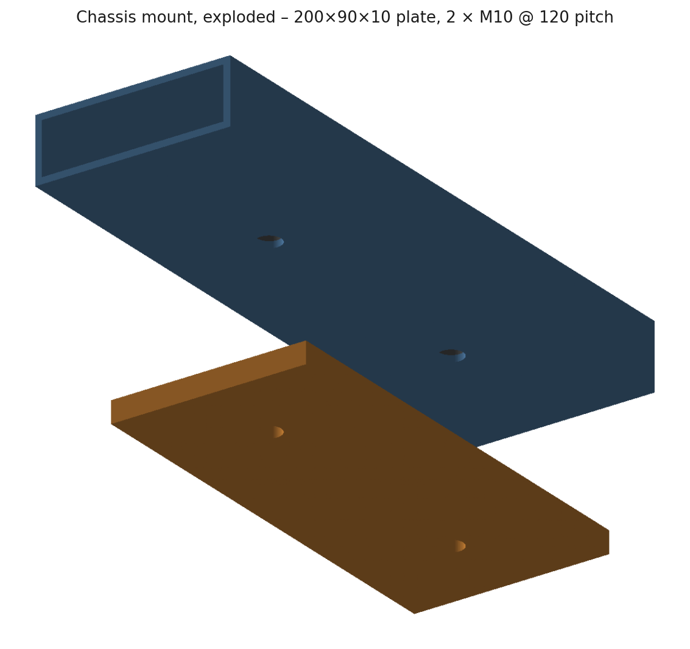
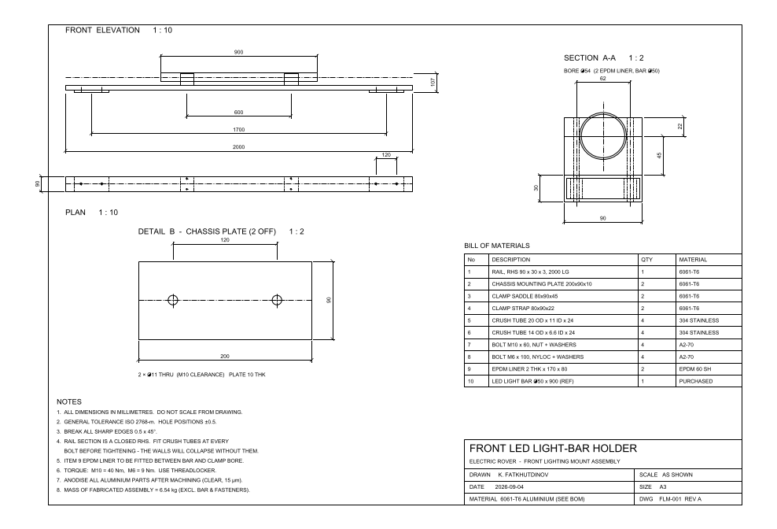

# Front LED Light-Bar Holder — Electric Rover

A bracket that carries a Ø50 × 900 mm LED light bar across the front of an
electric rover: a 2 m rail bolted to two chassis pick-up points, with two
split clamps holding the light bar 45 mm above it.

---

## Key features

- **A fully parametric assembly.** Every dimension lives in one parameter block;
  change a number and the whole model — solids, holes, fastener positions,
  drawing sheet — regenerates.
- **A stiffness-driven rail section**, chosen by running the beam case rather
  than by picking a plausible-looking bar.
- **Crush tubes at every bolt**, so the closed rail section survives being
  torqued up.
- **A 2 mm EPDM liner between clamp and light bar**, with the bore opened to
  suit, isolating aluminium from the light-bar housing.
- **An A3 manufacturing drawing generated from the same source as the 3D
  model**, so the sheet and the solids cannot disagree.
- **Two exchangeable rail sections** — the RHS as built, and the original flat
  bar — selectable from one parameter for anyone who wants to see the
  comparison.

---

## The completed design

Origin is the centre of the rail, on its top face. **+X** along the rail,
**+Y** forward (the way the light points), **+Z** up.

| Item | Description | Qty | Material |
|---|---|---|---|
| 1 | Rail, RHS 90 × 30 × 3, 2000 long | 1 | 6061-T6 |
| 2 | Chassis mounting plate 200 × 90 × 10, 2 × Ø11 @ 120 | 2 | 6061-T6 |
| 3 | Clamp saddle 80 × 90 × 45, Ø54 bore | 2 | 6061-T6 |
| 4 | Clamp strap 80 × 90 × 22, Ø54 bore | 2 | 6061-T6 |
| 5 | Crush tube 20 OD × 11 ID × 24 | 4 | 304 stainless |
| 6 | Crush tube 14 OD × 6.6 ID × 24 | 4 | 304 stainless |
| 7 | Bolt M10 × 60, nut + washers | 4 | A2-70 |
| 8 | Bolt M6 × 100, nyloc + washers | 4 | A2-70 |
| 9 | EPDM liner 2 thk × 170 × 80 | 2 | EPDM 60 Sh |
| 10 | LED light bar Ø50 × 900 *(reference)* | 1 | purchased |

Envelope **2000 × 90 × 110 mm**, fabricated mass **6.54 kg** (6.28 kg aluminium
+ 0.26 kg stainless), light bar and fasteners excluded.

## The manufacturing drawing

An A3 sheet drawn 1:1 in millimetres — front elevation and plan at 1:10,
section A-A through a clamp and the chassis plate detail at 1:2, with a title
block, BOM and notes. Dimensions carry a `DIMLFAC` override, so every one reads
the true size of the part despite the view scale.

It exists twice, from the same source:

- **on the `A3 DRAWING` layout of the 3D DWG** — paper space, A3 page already
  set up, so the finished file carries the sheet and the model together.
- **`cad/front-led-mount-drawing.dxf`** — the same sheet in model space as a
  standalone file, for importing into someone else's drawing or handing to a
  shop that does not want the 3D model.

## Why the model is built by script

The assembly is described by an AutoLISP program rather than placed by hand, and
the parameters live in one block at the top of it. That choice is what makes
decision 1 possible: swapping the rail from flat bar to RHS is one symbol, and
the plates, the crush tubes, the bolt lengths and the drawing sheet all follow.
Hand-modelled, that comparison would have been a day's rework and would
therefore not have been made.

The same parameters are mirrored in `params.py`, which drives the drawing
generator — so the sheet's dimensions come from the same numbers as the solids
rather than from someone reading them off the model.

---

## Next steps and possible improvements

- **Fit the rover's real numbers.** `RAIL_LEN` and `PLATE_CTR_X` are taken from
  the original drawing's extents, not from the vehicle. They are the two
  parameters most likely to be wrong.
- **Confirm the light bar's actual mass**; 2.5 kg is assumed. Deflection and
  first-mode frequency scale roughly with √mass, so a 4 kg bar moves the 26 Hz
  result to about 21 Hz.
- **Run a proper modal analysis if the rover sees sustained excitation above
  ~15 Hz.** The 26 Hz figure is a hand calculation on a uniform beam with
  distributed mass; the real structure has two discrete clamp masses and a bar
  that contributes its own stiffness.
- **Add a slotted adjustment in the saddle** if the light bar needs aiming after
  mounting. The aim is presently fixed by the bore axis, which means getting it
  wrong is a re-machining job rather than a spanner job.
- **Reconsider the mount span.** 1700 mm between supports is inherited from the
  original construction lines. Moving the plates outboard is the cheapest
  remaining stiffness gain available — deflection goes as span⁴ between
  supports — and costs nothing but chassis pick-up points.
- **Check the bolted joint properly.** The crush tubes make the joint sane, but
  no preload, slip or bearing calculation has been done; the M10s are sized by
  convention rather than by analysis.
- **Add a drainage path.** A 2 m closed section pointing into the weather on a
  rover will collect water at one end. A small hole at the low point costs
  nothing and is easier to add now than after anodising.
- **Corrosion at the aluminium/stainless interface.** The crush tubes sit
  directly in the aluminium rail. For anything other than dry-weather use, an
  insulating washer or a coated sleeve is worth the extra part number.
